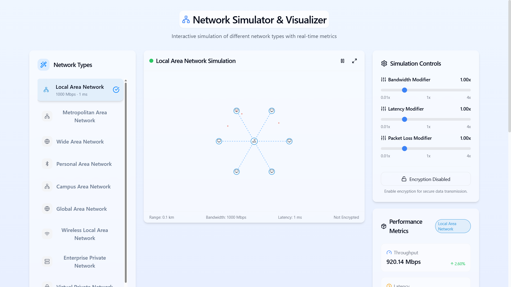
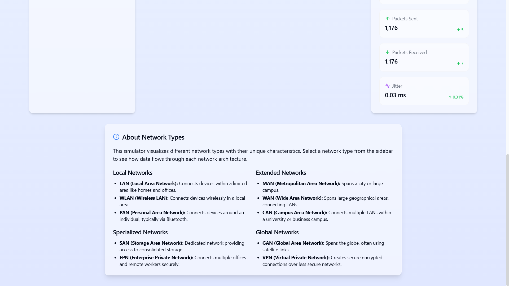

# Network Simulator & Visualizer

**Live Demo:** [https://network-simulgraf.lovable.app/](https://network-simulgraf.lovable.app/)




## Overview
An interactive platform to explore and compare different network types in real-time:
- LAN, MAN, WAN, PAN, CAN, GAN, WLAN, EPN, VPN, SAN
- Real-time data visualization
- Performance comparison tools
- Interactive UI controls

## Tech Stack
This project is built with:
- Vite
- TypeScript
- React
- shadcn-ui
- Tailwind CSS

## Setup
The only requirement is having Node.js & npm installed - [install with nvm](https://github.com/nvm-sh/nvm#installing-and-updating)

Follow these steps:

```sh
# Step 1: Clone the repository using the project's Git URL.
git clone <YOUR_GIT_URL>

# Step 2: Navigate to the project directory.
cd <YOUR_PROJECT_NAME>

# Step 3: Install the necessary dependencies.
npm i

# Step 4: Start the development server with auto-reloading and an instant preview.
npm run dev
```

### Edit a file directly in GitHub
1. Navigate to the desired file(s).
2. Click the "Edit" button (pencil icon) at the top right of the file view.
3. Make your changes and commit the changes.

### Use GitHub Codespaces
1. Navigate to the main page of your repository.
2. Click on the "Code" button (green button) near the top right.
3. Select the "Codespaces" tab.
4. Click on "New codespace" to launch a new Codespace environment.
5. Edit files directly within the Codespace and commit and push your changes once you're done.

---

For any inquiries, feel free to contact me at **davesohamm@gmail.com**

Enjoy exploring networks! 🚀

